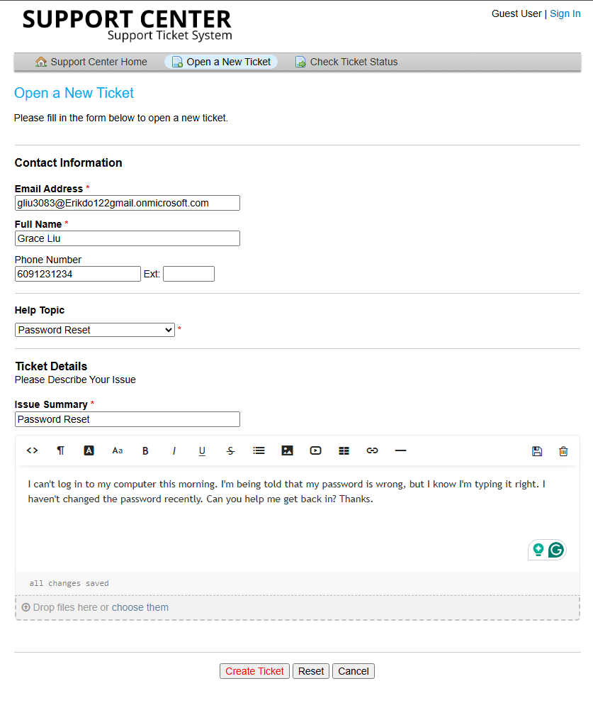
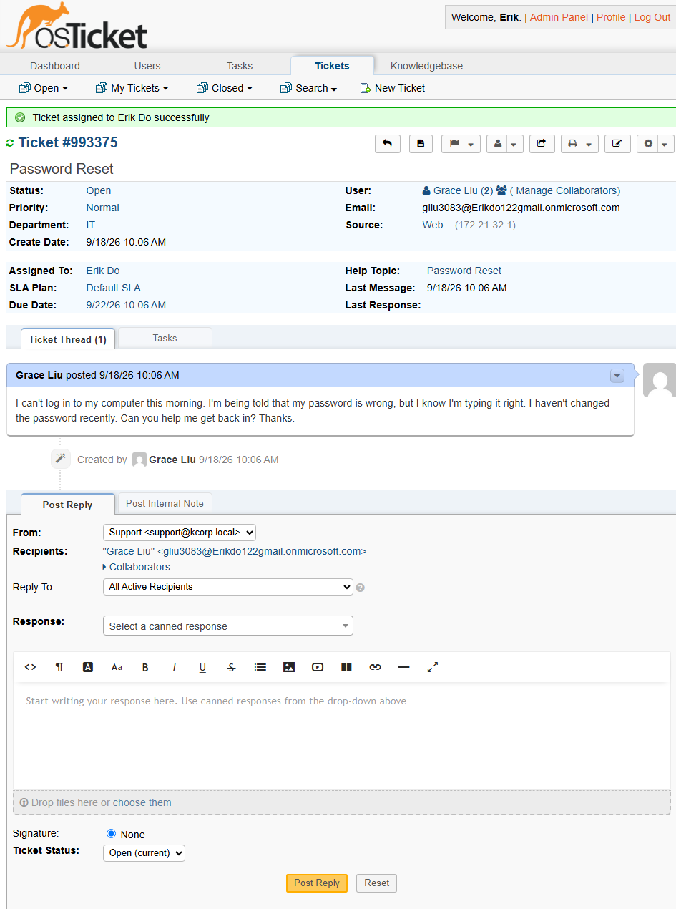
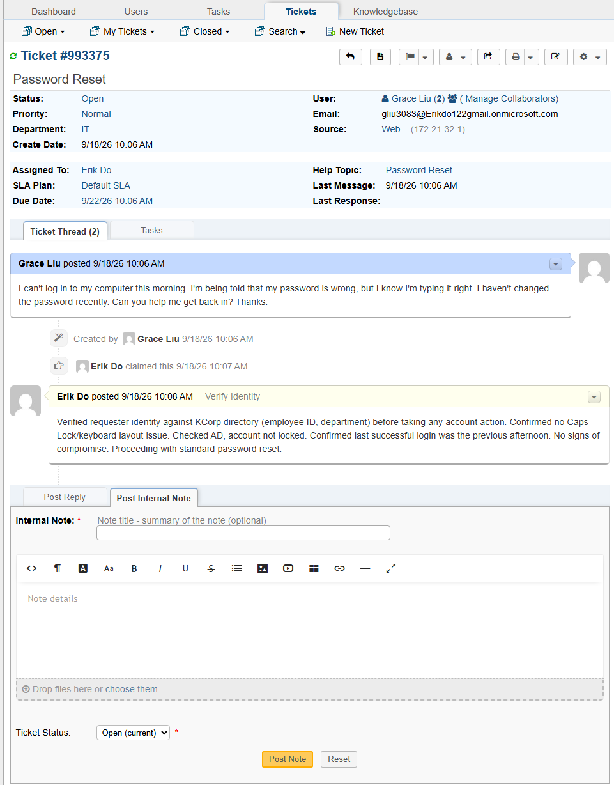
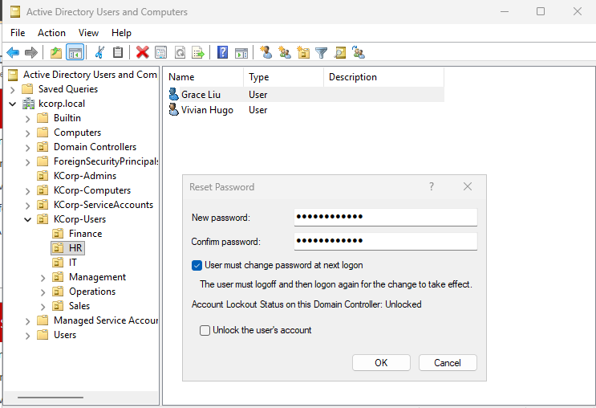
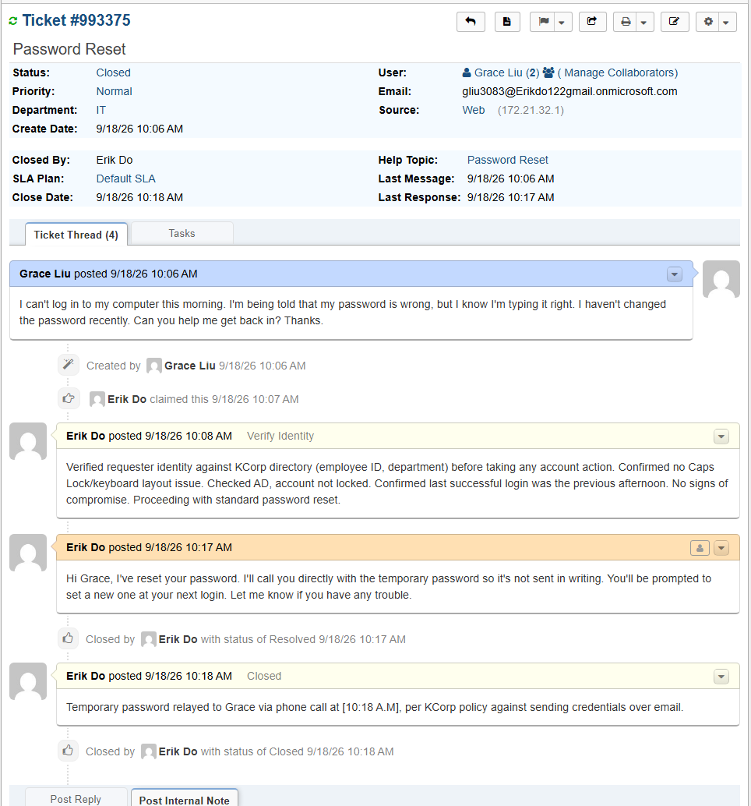

# TICKET-001: Unable to Log In, Password Reset Needed

**Requester:** Grace Liu (HR Assistant, HR Department)
**Priority:** Normal
**Help Topic:** Password Reset
**Department:** IT

## Status History

| Status | Timestamp | Note |
|---|---|---|
| New | 10:06 AM | Ticket submitted via customer portal |
| Assigned | 10:07 AM | Assigned to IT agent |
| In Progress | 10:06 AM | Identity verified, troubleshooting started |
| Resolved | 10:17 AM | Password reset in Active Directory, customer-facing reply sent |
| Closed | 10:18 AM | Temporary password relayed by phone, closed after confirming login worked |

## Issue Description

Grace submitted a ticket saying she couldn't log into her computer. Her exact words: she kept getting told her password was wrong even though she was sure she was typing it correctly, and she hadn't changed it recently.

## Troubleshooting Performed

1. Verified Grace's identity against the KCorp directory (employee ID, department) before touching the account.
2. Asked if Caps Lock or a keyboard layout issue could explain it. She confirmed neither applied.
3. Checked the account in Active Directory. It wasn't locked out, which ruled that out as the cause.
4. Asked when she last logged in successfully. She said the previous afternoon, with nothing unusual in between (no travel, no shared device).
5. Based on all of that, this looked like a straightforward forgotten or mistyped password rather than a lockout or compromised account, so I proceeded with a standard reset.

## Root Cause

Forgotten password. No lockout, no signs of compromise.

## Resolution

Reset Grace's password in Active Directory Users and Computers and required a password change at next login.

Rather than send the temporary password through the ticket reply, I called Grace directly to give it to her, since sending credentials in writing over email or a ticket thread isn't good practice even for a temporary password. The ticket reply let her know a call was coming instead of including the password itself. She confirmed she was able to log in and set a new permanent password.

## User Impact

One user, about 12 minutes without access. No impact to anyone else.

## Knowledge Base Reference

[KB-001: Password Reset Procedure](../knowledge-base/KB-001-password-reset.md)
