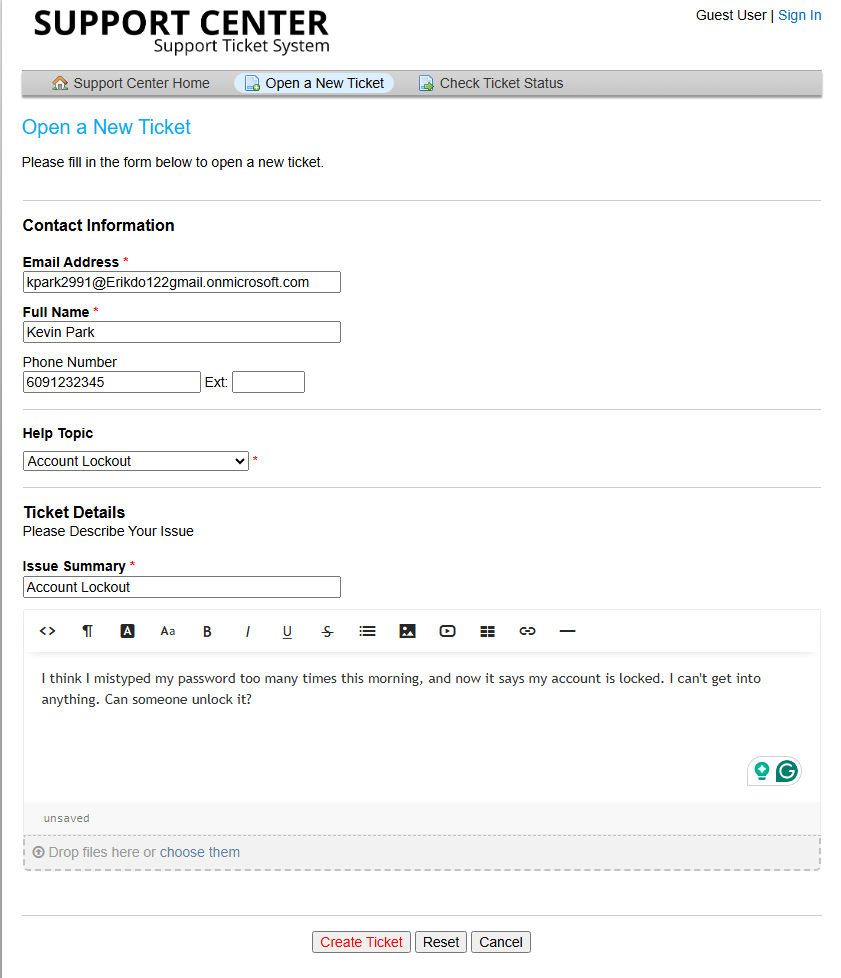
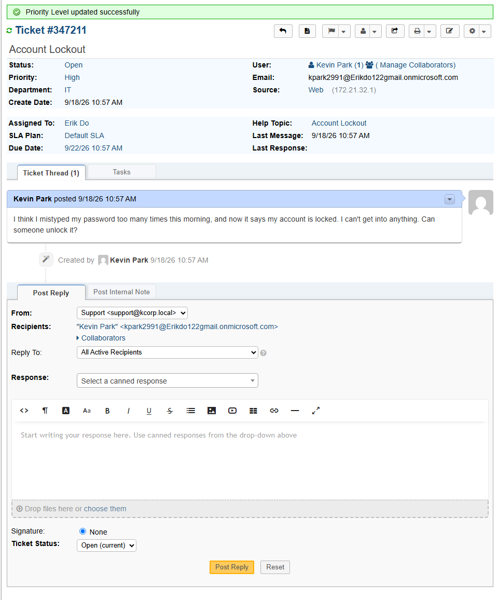
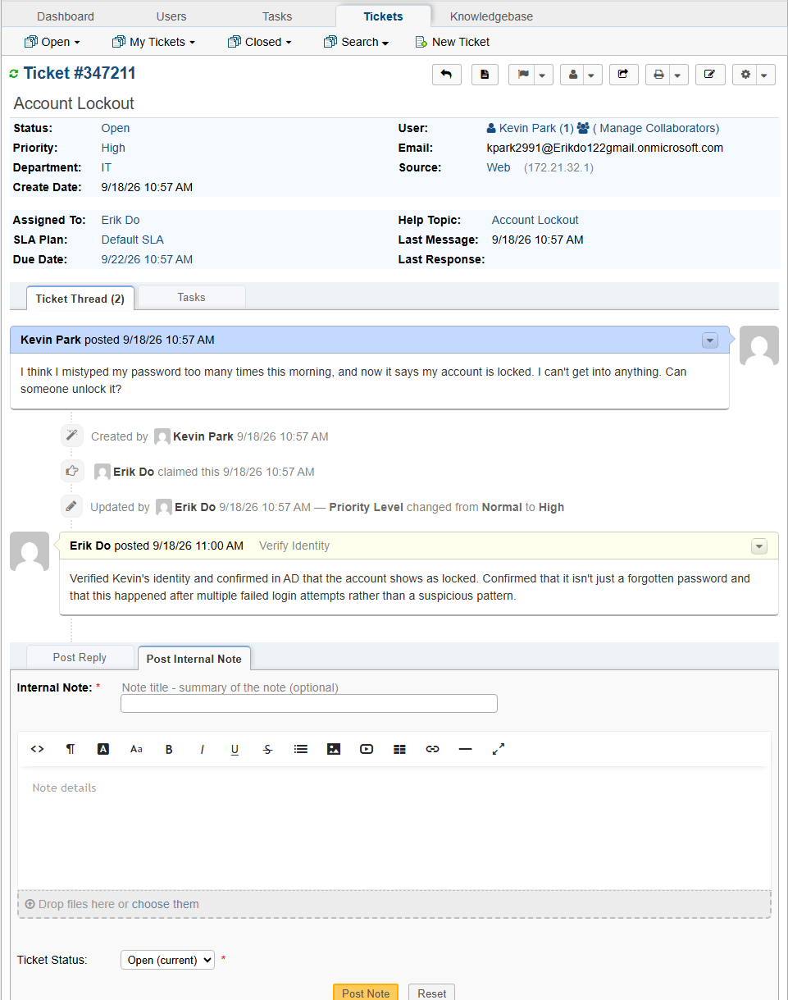
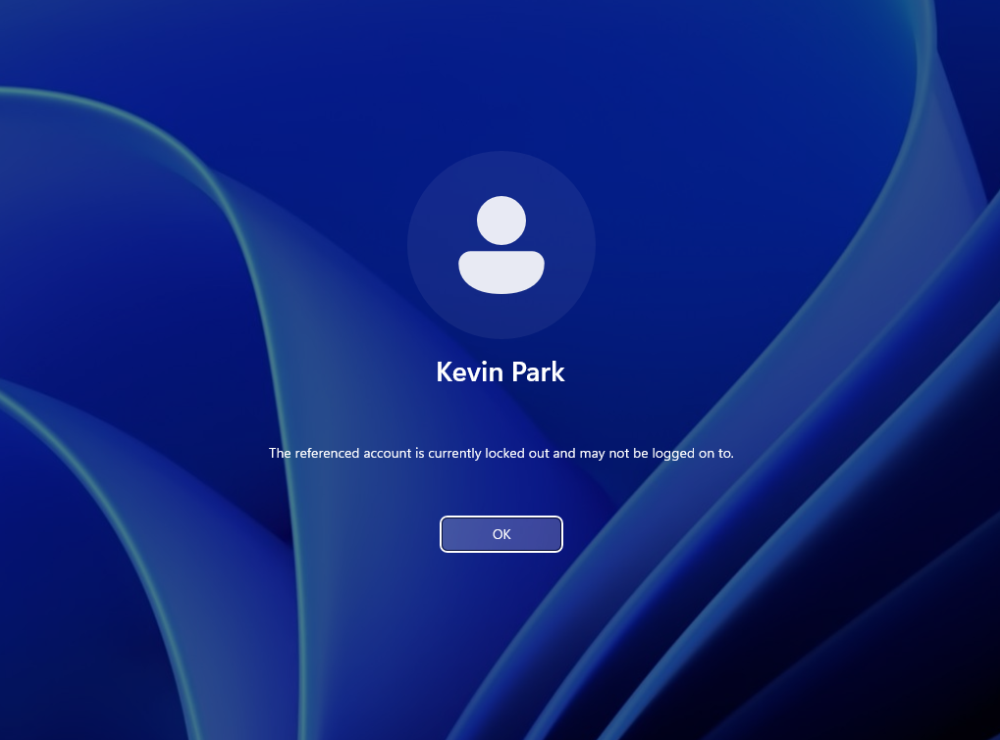
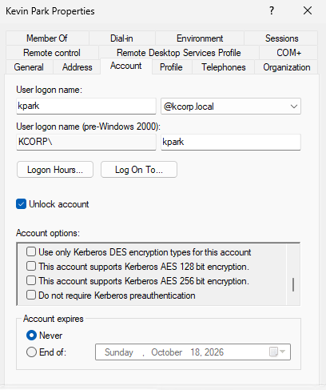
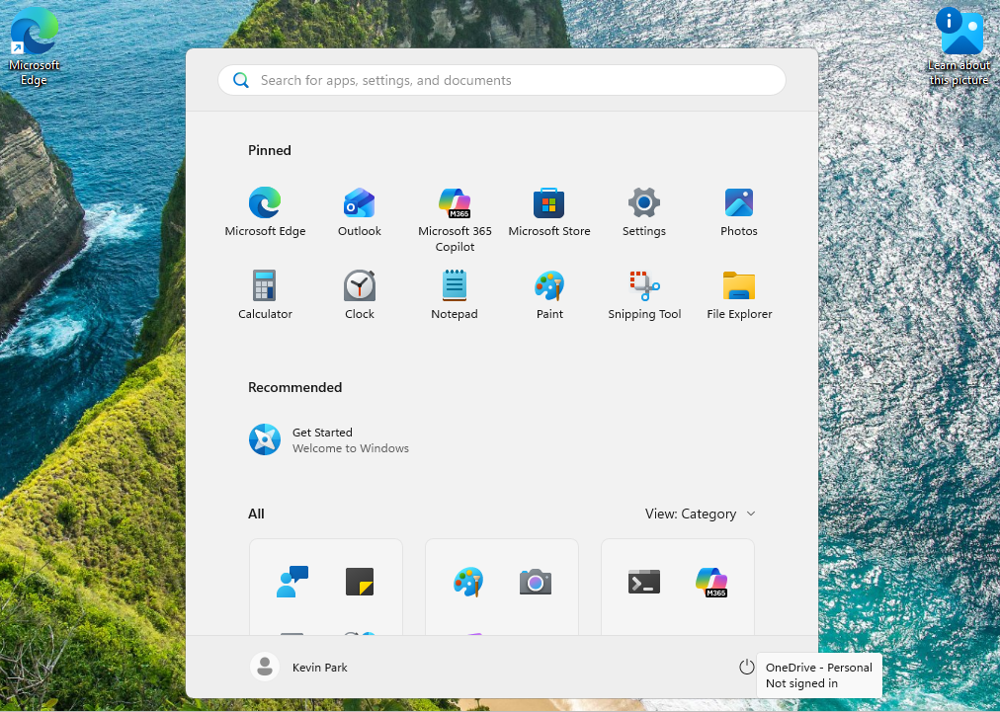
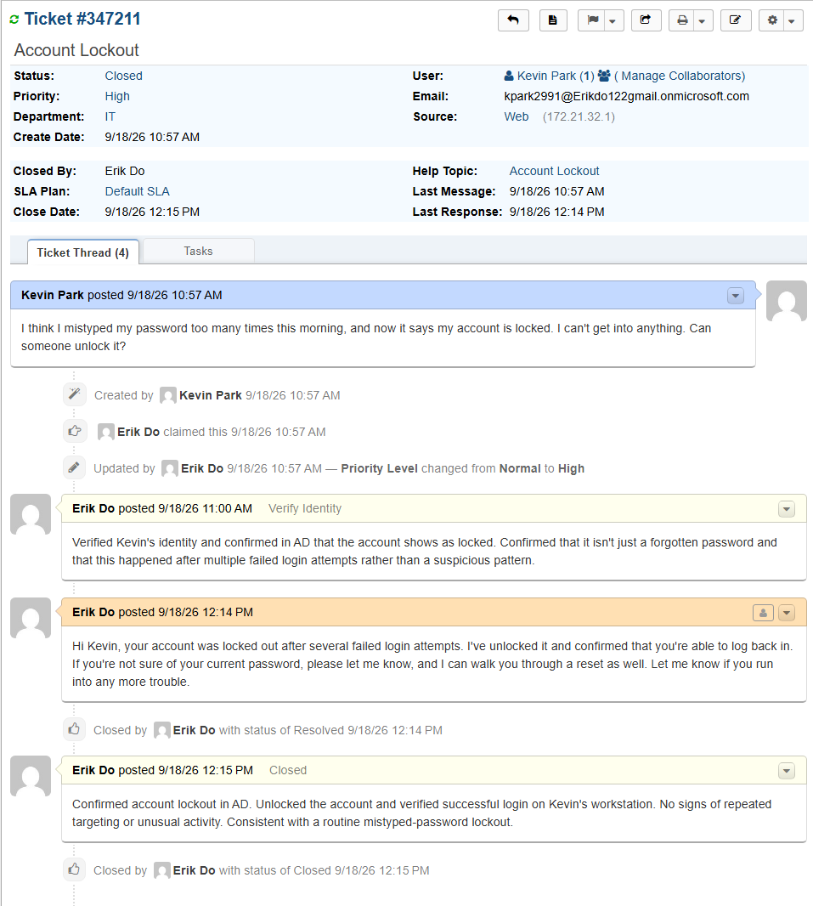

# TICKET-002: Account Locked Out

**Requester:** Kevin Park (Finance Advisor, Finance Department)
**Priority:** High
**Help Topic:** Account Lockout
**Department:** IT

## Status History

| Status | Timestamp | Note |
|---|---|---|
| New | 10:57 AM | Ticket submitted via customer portal |
| Assigned | 10:57 AM | Assigned to IT agent, priority raised to High |
| In Progress | 10:57 AM | Identity verified, troubleshooting started |
| Resolved | 12:15 PM | Account unlocked, login verified |
| Closed | 12:15 PM | Closed after confirming Kevin was able to log in |

## Issue Description

Kevin submitted a ticket saying he thought he mistyped his password too many times that morning and his account was now locked. He said he couldn't get into anything and needed it unlocked.

## Troubleshooting Performed

1. Verified Kevin's identity against the KCorp directory before touching the account.
2. Raised the ticket priority to High, since a full lockout blocks all work, not just a login inconvenience.
3. Checked with Kevin on what led up to the lockout. He confirmed it followed several failed login attempts that morning, nothing else unusual.
4. Confirmed on his workstation that Windows was actually showing the account as locked, not just a login failure.
5. Nothing about the pattern suggested targeting or suspicious activity, just a routine mistyped-password lockout.

## Root Cause

Account lockout triggered by repeated failed login attempts. No signs of compromise or targeting.

## Resolution

Unlocked Kevin's account in Active Directory Users and Computers.

Logged into his workstation to confirm the unlock actually worked rather than just assuming it based on the AD change.

Replied to Kevin confirming the account was unlocked and offered a password reset as well in case he wasn't confident in his current password. Closed the ticket after confirming with him that he was back in.

## User Impact

One user, about an hour and eighteen minutes without account access. No impact to anyone else.

## Knowledge Base Reference

[KB-002: Account Lockout Procedure](../Knowledge-Base/KB-002-account-lockout.md)
