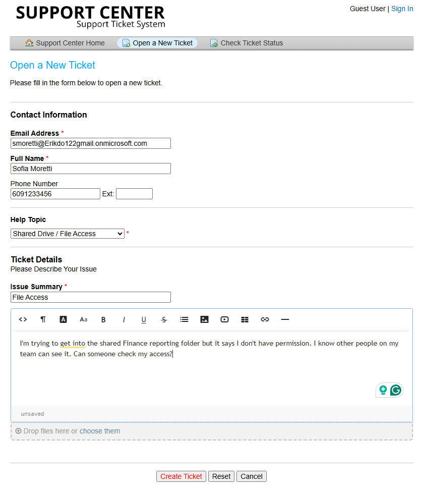
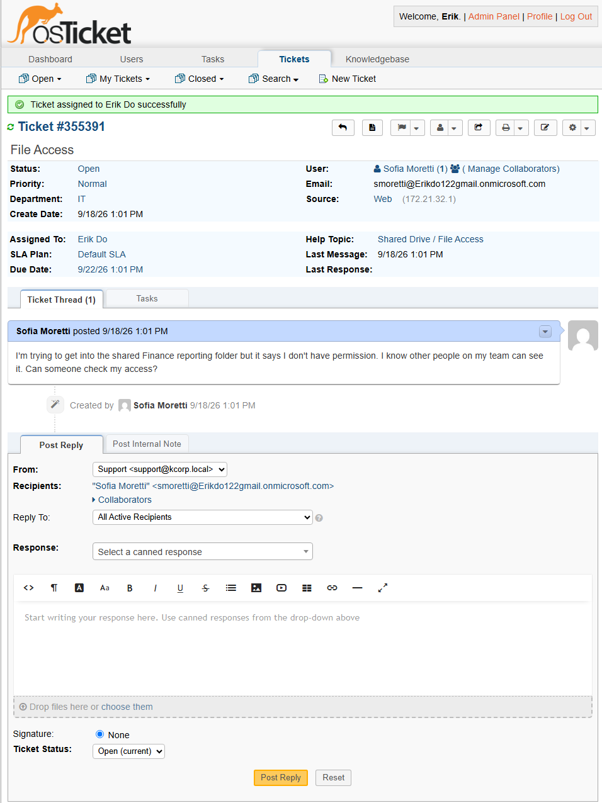
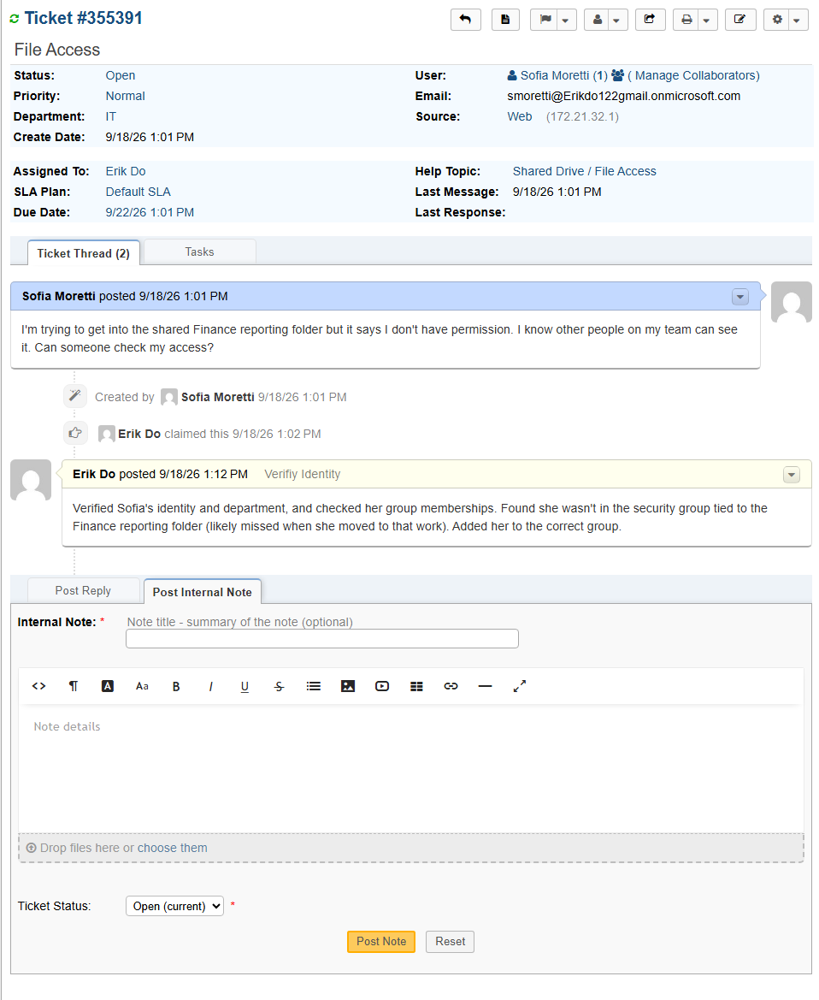
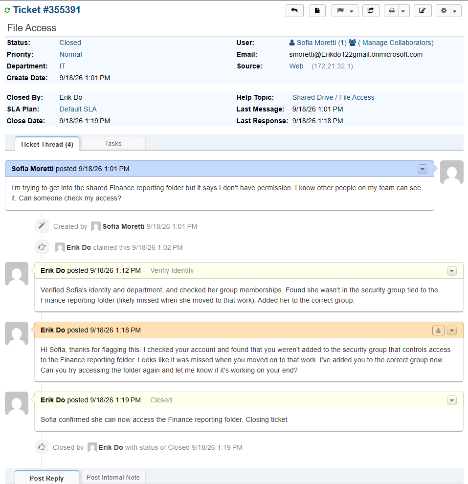

# TICKET-003: Unable to Access Shared Finance Folder

**Requester:** Sofia Moretti (Accountant, Finance Department)
**Priority:** Normal
**Help Topic:** Shared Drive/File Access
**Department:** IT

## Status History

| Status | Timestamp | Note |
|---|---|---|
| New | 1:01 PM | Ticket submitted via customer portal |
| Assigned | 1:01 PM | Assigned to IT agent |
| In Progress | 1:01 PM | Identity verified, troubleshooting started |
| Resolved | 1:19 PM | Added to correct security group, access confirmed |
| Closed | 1:19 PM | Closed after Sofia confirmed access was working |

## Issue Description

Sofia submitted a ticket saying she couldn't get into the shared Finance reporting folder her team uses. She mentioned other people on her team could see it fine, just not her.

## Troubleshooting Performed

1. Verified Sofia's identity and current role before making any access changes.
2. Checked her group memberships against the security group tied to the Finance reporting folder.
3. Found she wasn't in that group, most likely missed when she moved onto the reporting work.
4. Added her to the correct group.

## Root Cause

Sofia wasn't added to the security group controlling access to the Finance reporting folder when she took on that work.

## Resolution

Added Sofia to the correct security group and asked her to confirm access before closing the ticket. She confirmed shortly after that she could get into the folder.

## User Impact

One user, about 18 minutes without access to the folder. No impact to anyone else.

## Knowledge Base Reference

[KB-003: Shared Drive Access Procedure](../Knowledge-Base/KB-003-shared-drive-access.md)
