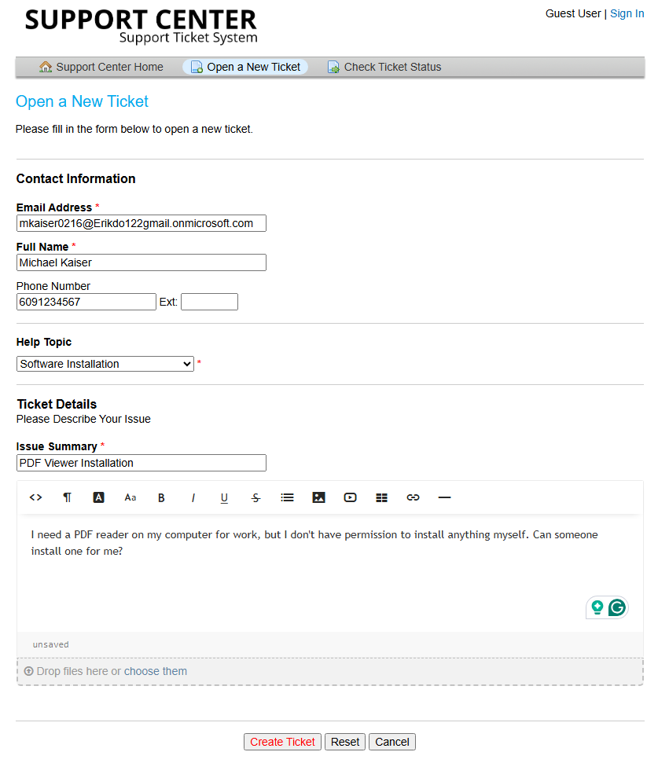
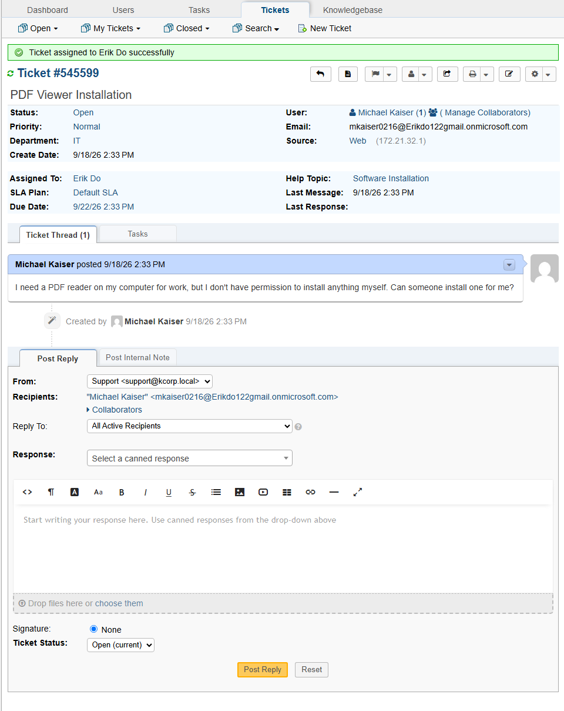
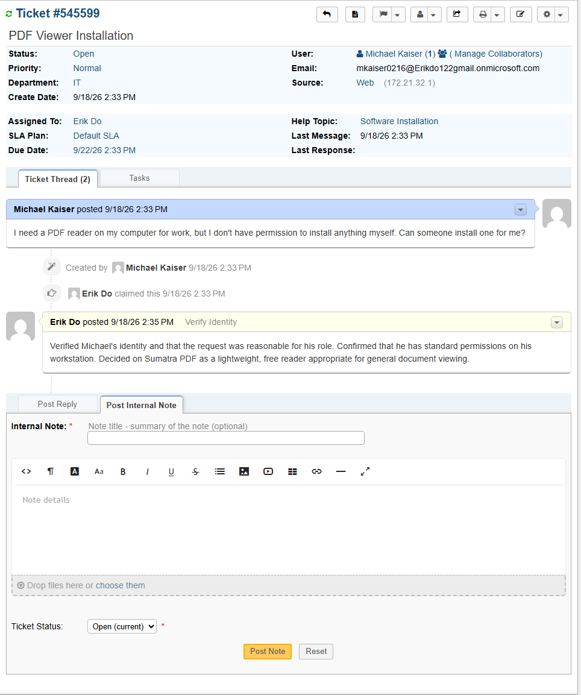
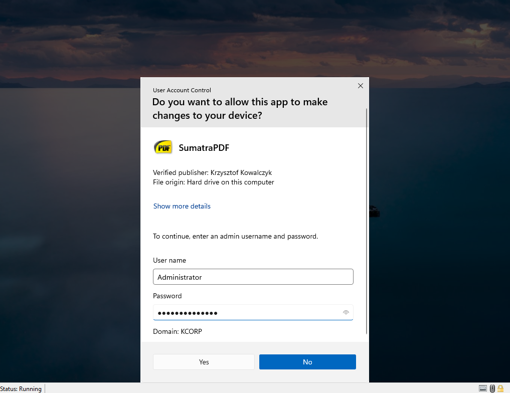
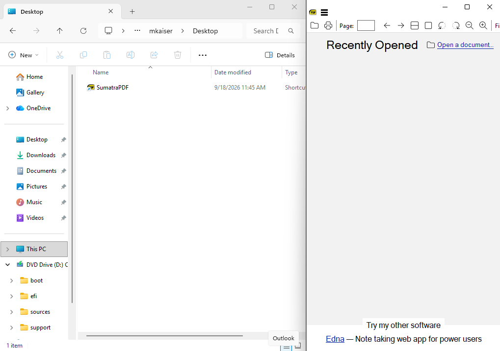
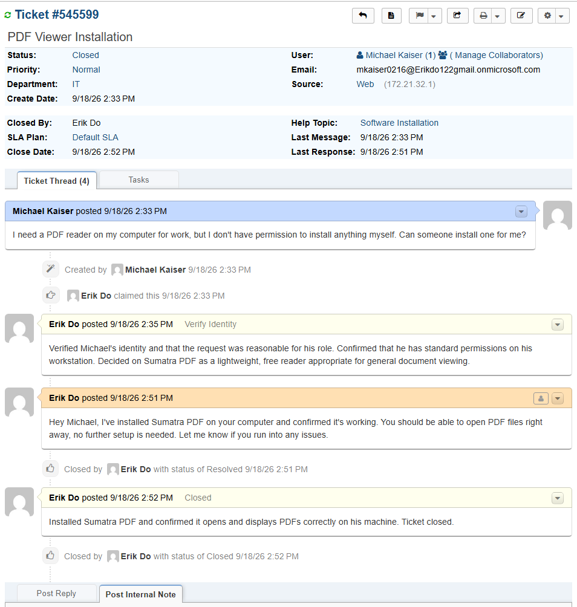

# TICKET-004: PDF Reader Installation Request

**Requester:** Michael Kaiser (Sales Representative, Sales Department)
**Priority:** Normal
**Help Topic:** Software Installation
**Department:** IT

## Status History

| Status | Timestamp | Note |
|---|---|---|
| New | 2:33 PM | Ticket submitted via customer portal |
| Assigned | 2:33 PM | Assigned to IT agent |
| In Progress | 2:33 PM | Identity verified, troubleshooting started |
| Resolved | 2:52 PM | Sumatra PDF installed and confirmed working |
| Closed | 2:52 PM | Closed after confirming install worked |

## Issue Description

Michael submitted a ticket asking for a PDF reader to be installed on his computer, since he didn't have permission to install software himself.

## Troubleshooting Performed

1. Verified Michael's identity and confirmed the request made sense for his role.
2. Confirmed he has standard, non-admin permissions on his workstation, consistent with company policy.
3. Chose Sumatra PDF, a lightweight, free PDF reader suitable for general document viewing.

## Root Cause

Standard, non-admin user account without local install permissions, so the request needed to be fulfilled by IT rather than the user themselves.

## Resolution

Installed Sumatra PDF on Michael's workstation and opened a test PDF to confirm it displayed correctly.

Replied to Michael confirming the install was complete and working.

## User Impact

One user, about 19 minutes without a PDF reader. No impact to anyone else.

## Knowledge Base Reference

[KB-004: Software Installation Requests](../Knowledge-Base/KB-004-software-installation.md)
