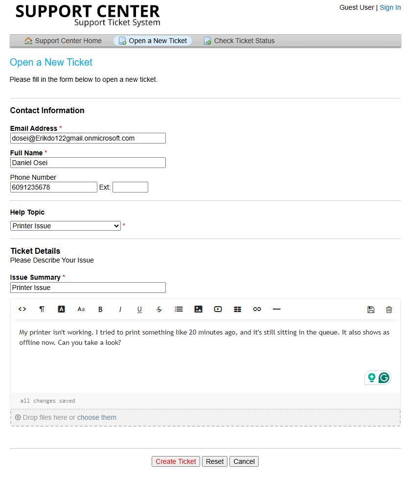
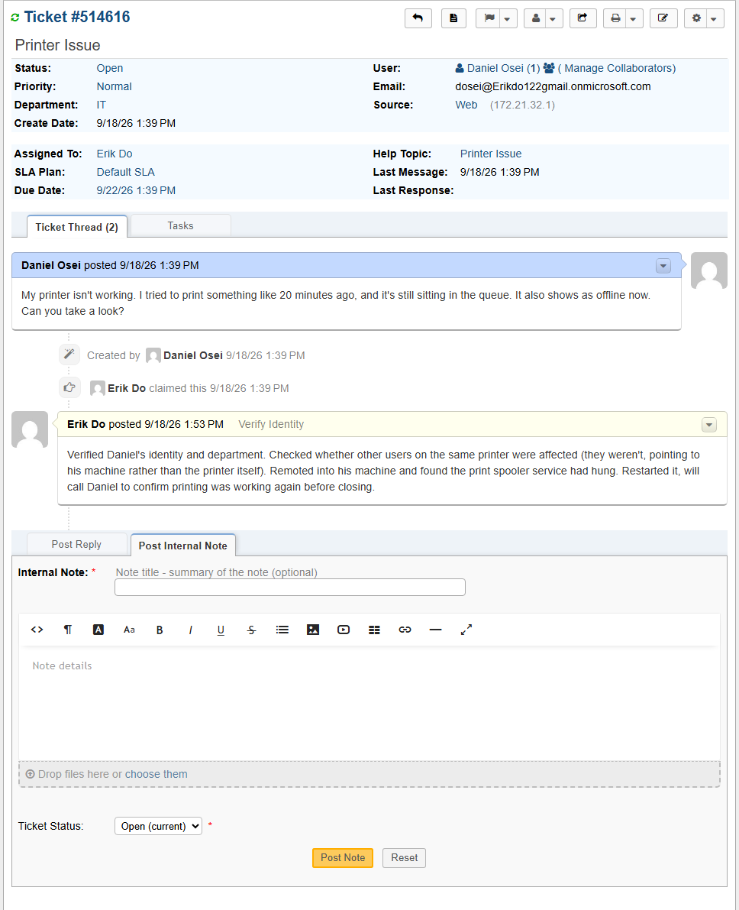
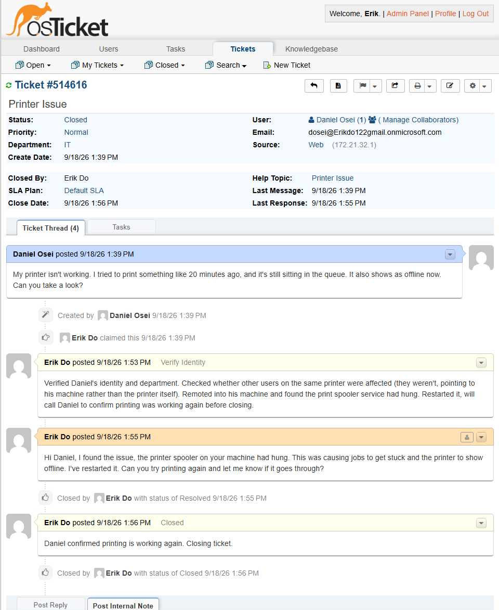

# TICKET-005: Printer Not Working

**Requester:** Daniel Osei (HR Generalist, HR Department)
**Priority:** Normal
**Help Topic:** Printer Issue
**Department:** IT

## Status History

| Status | Timestamp | Note |
|---|---|---|
| New | 1:39 PM | Ticket submitted via customer portal |
| Assigned | 1:39 PM | Assigned to IT agent |
| In Progress | 1:39 PM | Identity verified, troubleshooting started |
| Resolved | 1:56 PM | Print spooler restarted, confirmed working by phone |
| Closed | 1:56 PM | Closed after confirming with Daniel that printing worked |

## Issue Description

Daniel submitted a ticket saying a print job had been stuck in the queue for about 20 minutes and the printer was now showing as offline.

## Troubleshooting Performed

1. Verified Daniel's identity and department before making any changes.
2. Checked the shared printer's status and whether anyone else using it was having the same issue. No one else reported problems, pointing to something local to Daniel's workstation rather than the printer itself.
3. Remoted into his machine and found the print spooler service had hung.
4. Restarted the spooler.
5. Called Daniel to confirm printing was working before closing.

## Root Cause

The print spooler service on Daniel's workstation had hung, which stopped jobs from processing and made the printer appear offline even though the printer itself was fine.

## Resolution

Restarted the print spooler service and confirmed by phone that printing was working again.

## User Impact

One user, about 17 minutes without printing access. No impact to anyone else, since the printer itself was never actually down.

## Knowledge Base Reference

[KB-005: Print Spooler Troubleshooting](../Knowledge-Base/KB-005-printer-troubleshooting.md)
