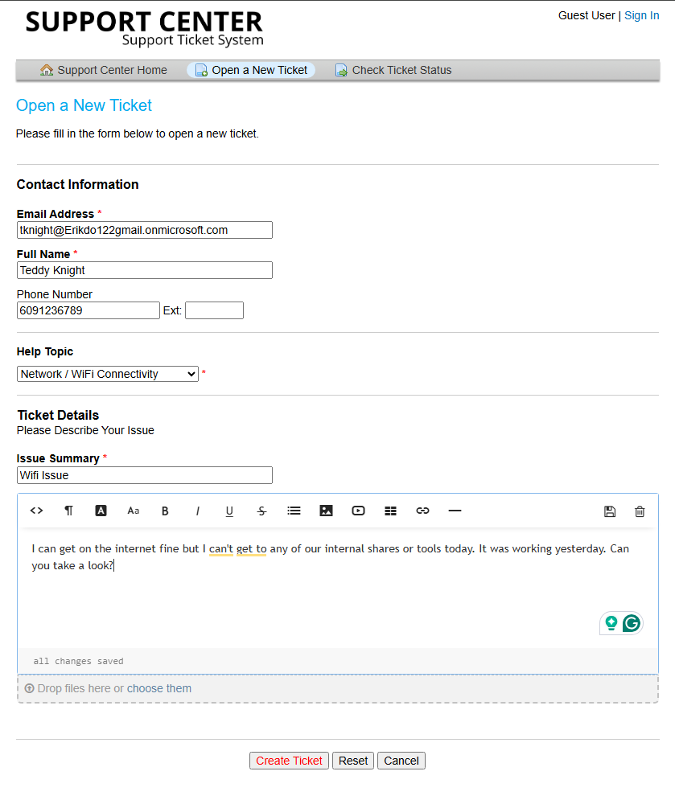
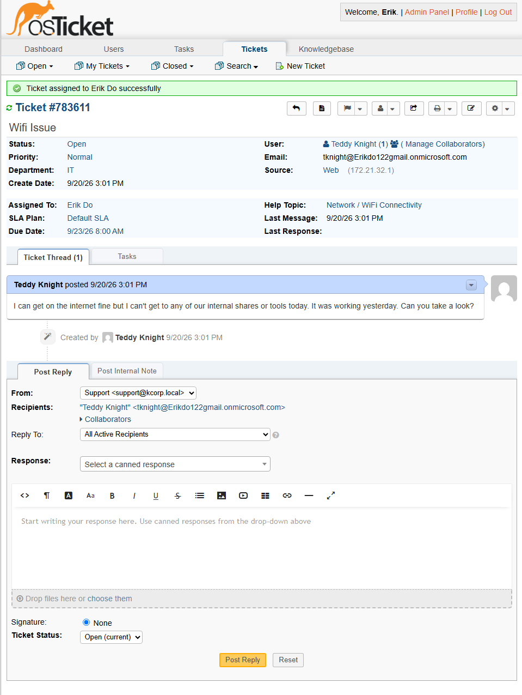
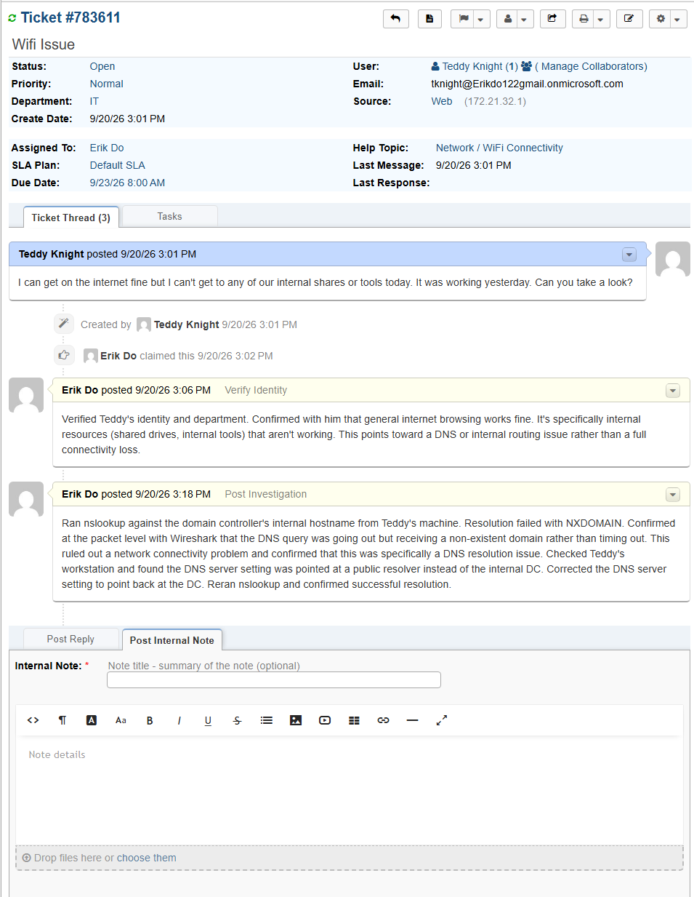
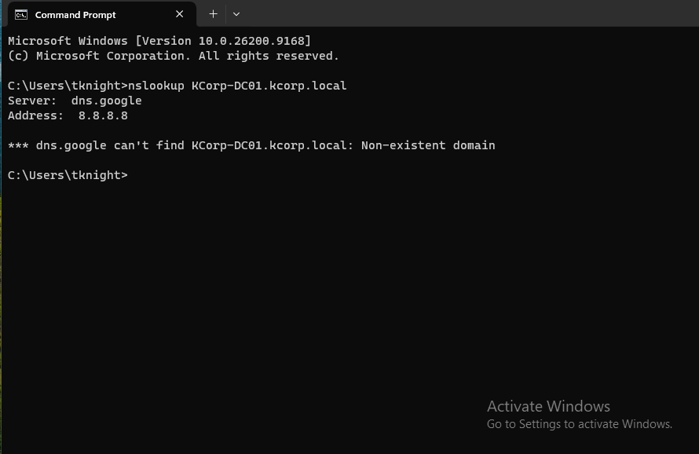
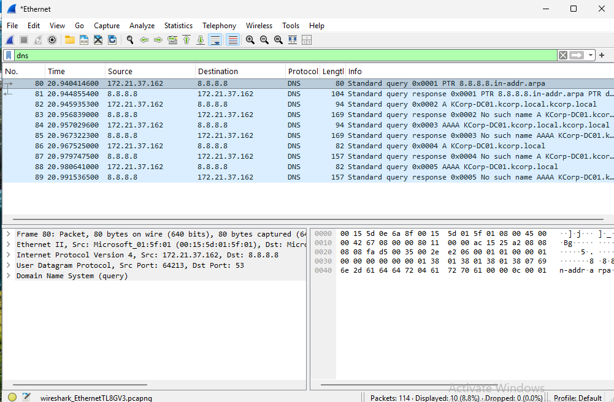
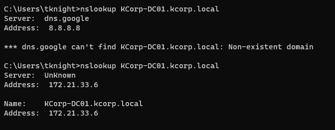
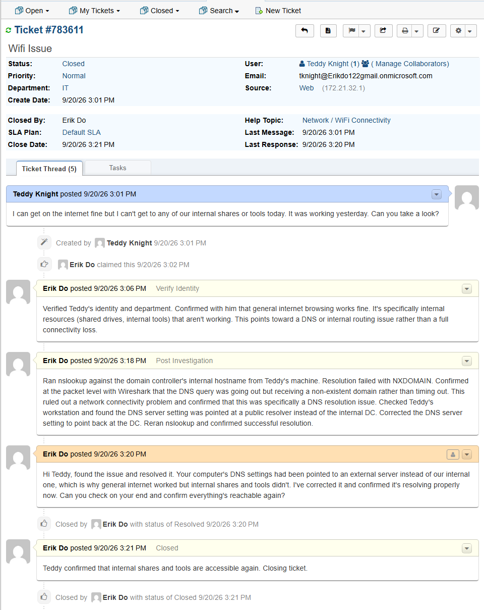

# TICKET-006: Unable to Reach Internal Shares and Tools

**Requester:** Teddy Knight (Operations Analyst, Operations Department)
**Priority:** Normal
**Help Topic:** Network/WiFi Connectivity
**Department:** IT

## Status History

| Status | Timestamp | Note |
|---|---|---|
| New | 3:01 PM | Ticket submitted via customer portal |
| Assigned | 3:01 PM | Assigned to IT agent |
| In Progress | 3:01 PM | Identity verified, initial triage started |
| Resolved | 3:20 PM | DNS setting corrected, resolution confirmed |
| Closed | 3:20 PM | Closed after Teddy confirmed access was restored |

## Issue Description

Teddy submitted a ticket saying general internet browsing was working fine, but he couldn't reach internal shared drives or internal tools. He said it had been working the day before.

## Troubleshooting Performed

1. Verified Teddy's identity and department before starting.
2. Confirmed with him that general internet access worked, it was specifically internal resources that weren't loading. That pointed toward a DNS or internal routing problem rather than a full connectivity loss, since a total network outage would affect everything, not just internal names.
3. Ran nslookup against the domain controller's internal hostname from Teddy's machine. Resolution failed with a non-existent domain (NXDOMAIN) response.
4. Confirmed at the packet level with Wireshark that the DNS query was actually going out and getting an NXDOMAIN response back, not simply timing out, which ruled out a network connectivity problem and pointed specifically at DNS resolution.
5. Checked Teddy's workstation network settings and found DNS was pointed at a public resolver instead of the internal domain controller, meaning internal hostnames were never going to resolve.
6. Corrected the DNS server setting back to the internal domain controller.
7. Reran nslookup and confirmed the internal hostname now resolved successfully.

## Root Cause

Teddy's workstation had its DNS server setting pointed at a public resolver instead of the internal domain controller. Public DNS servers have no record of internal domain names, so general internet browsing worked fine while anything relying on internal name resolution failed.

## Resolution

Corrected the DNS server setting on Teddy's workstation to point back at the internal domain controller and confirmed resolution was working with a successful nslookup before contacting him.

## User Impact

One user, about 19 minutes without access to internal shares and tools. No impact to anyone else, since this was isolated to Teddy's workstation configuration rather than a shared network or DNS server issue.

## Knowledge Base Reference

[KB-006: DNS Resolution Troubleshooting](../Knowledge-Base/KB-006-dns-troubleshooting.md)
