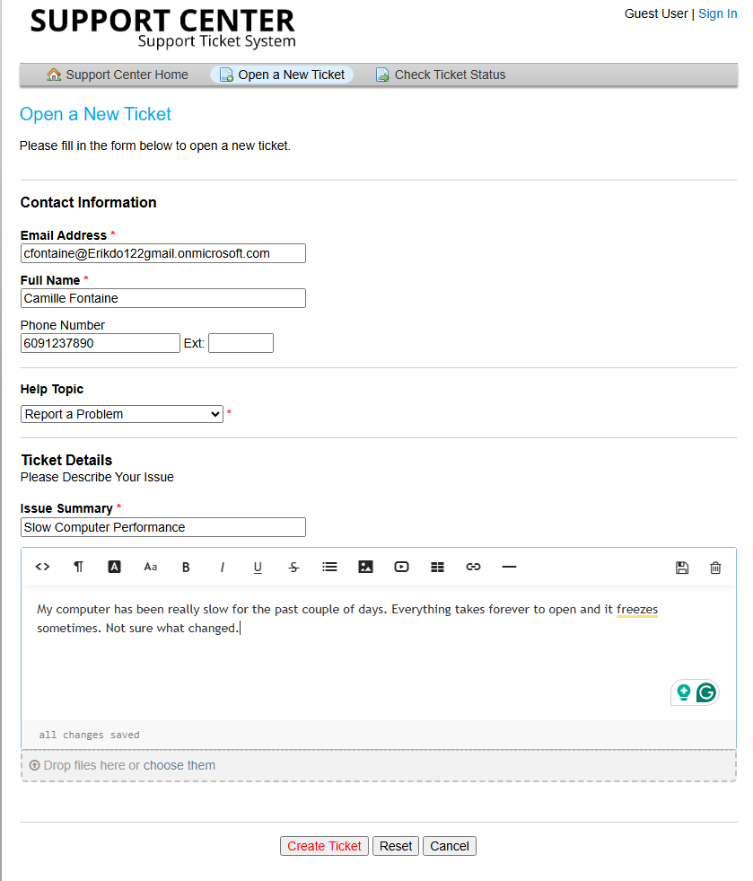
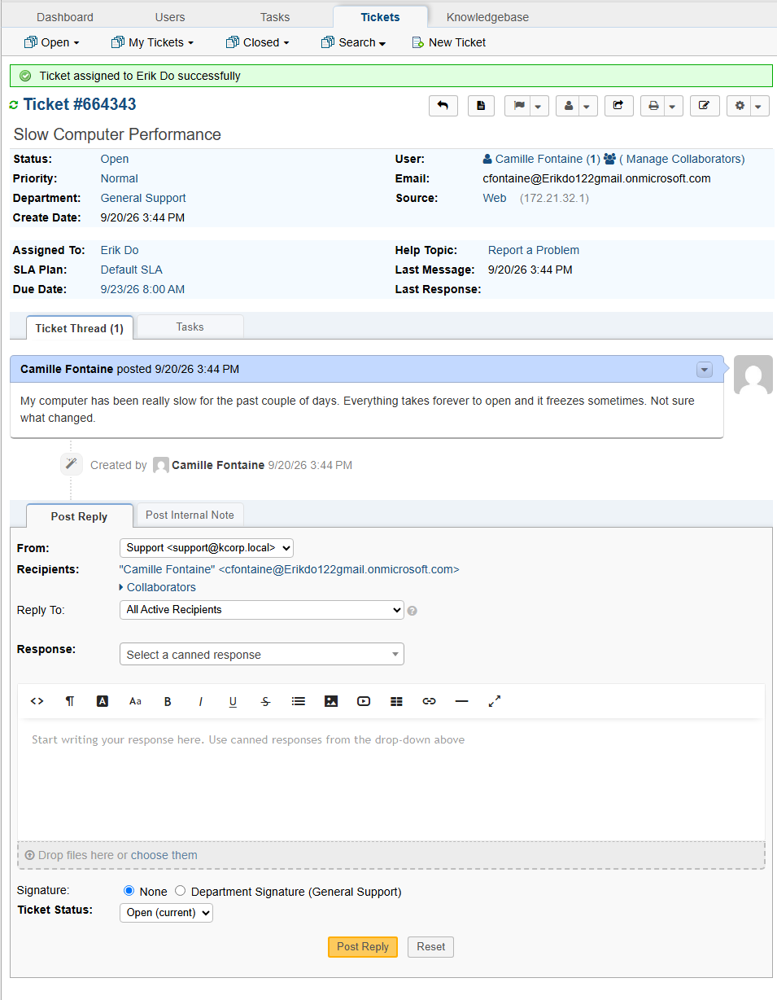
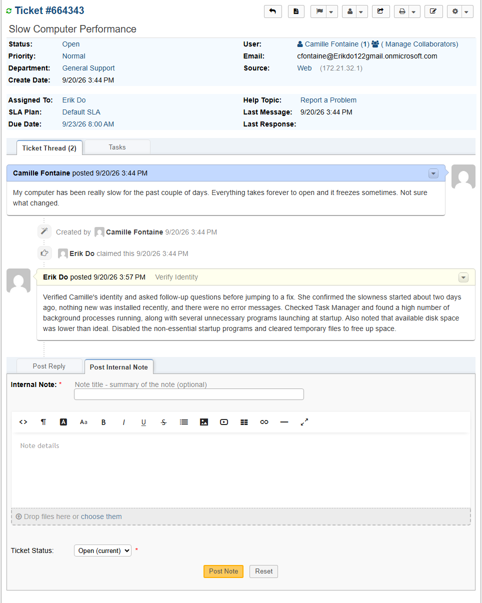
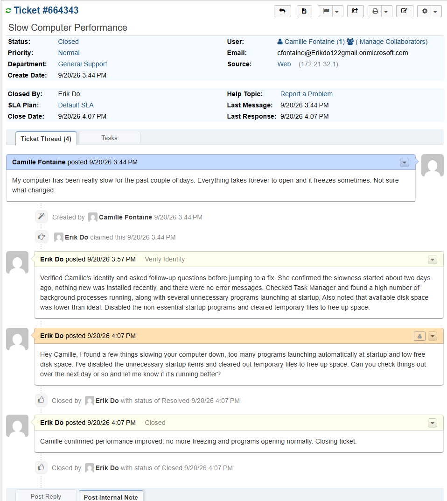

# TICKET-007: Computer Running Slow

**Requester:** Camille Fontaine (Sales Representative, Sales Department)
**Priority:** Normal
**Help Topic:** Report A Problem
**Department:** General Support

## Status History

| Status | Timestamp | Note |
|---|---|---|
| New | 3:44 PM | Ticket submitted via customer portal |
| Assigned | 3:44 PM | Assigned to IT agent |
| In Progress | 3:44 PM | Identity verified, triage started |
| Resolved | 4:07 PM | Startup programs disabled, disk space freed, confirmed improved |
| Closed | 4:07 PM | Closed after Camille confirmed performance improved |

## Issue Description

Camille submitted a ticket saying her computer had been running slow for a couple of days, everything taking longer to open and occasional freezing, with nothing specific that seemed to have changed.

## Troubleshooting Performed

1. Verified Camille's identity before starting.
2. Asked when the slowness started and whether anything had changed recently, like new software or updates. She confirmed nothing new had been installed and there were no error messages, just general sluggishness and occasional freezing.
3. Checked Task Manager and found a high number of background processes running.
4. Checked startup programs and found several unnecessary applications launching automatically at boot.
5. Checked available disk space and found it was lower than ideal.
6. Disabled the non-essential startup programs and cleared temporary files to free up space.

## Root Cause

A combination of too many programs launching at startup and low available disk space, both contributing to the slowdown rather than a single clear cause.

## Resolution

Disabled unnecessary startup programs and cleared temporary files to free up disk space. Asked Camille to monitor performance over the next day and confirm before closing.

## User Impact

One user, ongoing minor productivity loss over a couple of days rather than a hard outage. No impact to anyone else.

## Knowledge Base Reference

[KB-007: Slow Computer Troubleshooting](../Knowledge-Base/KB-007-slow-computer.md)
