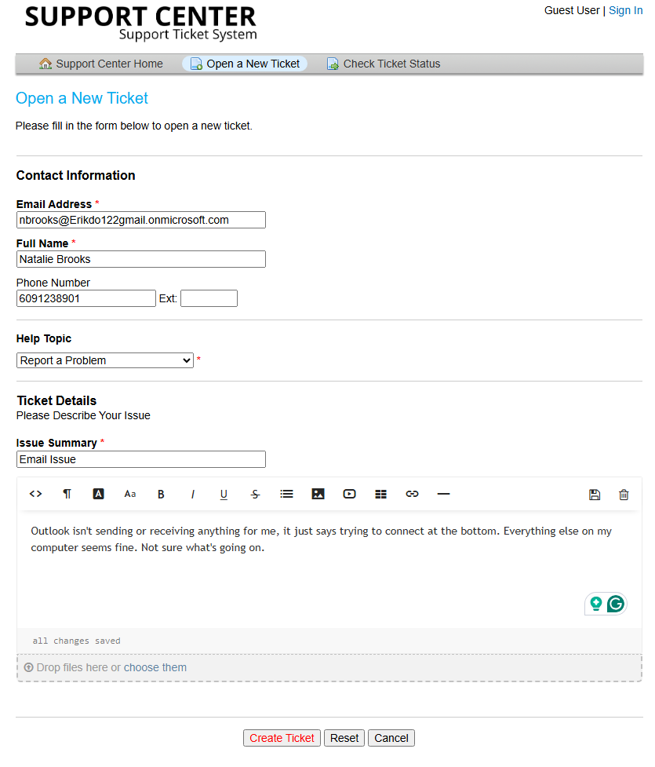
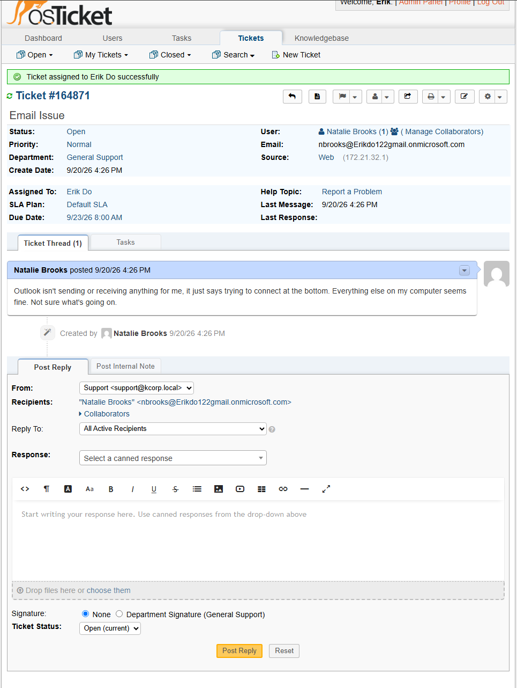
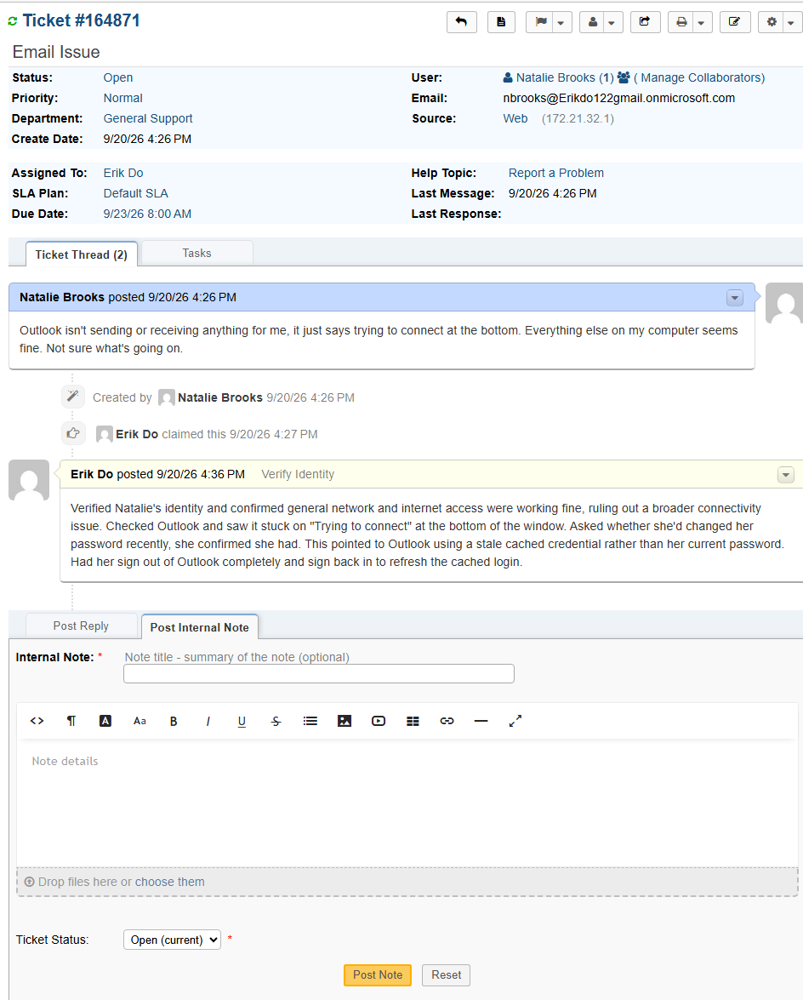
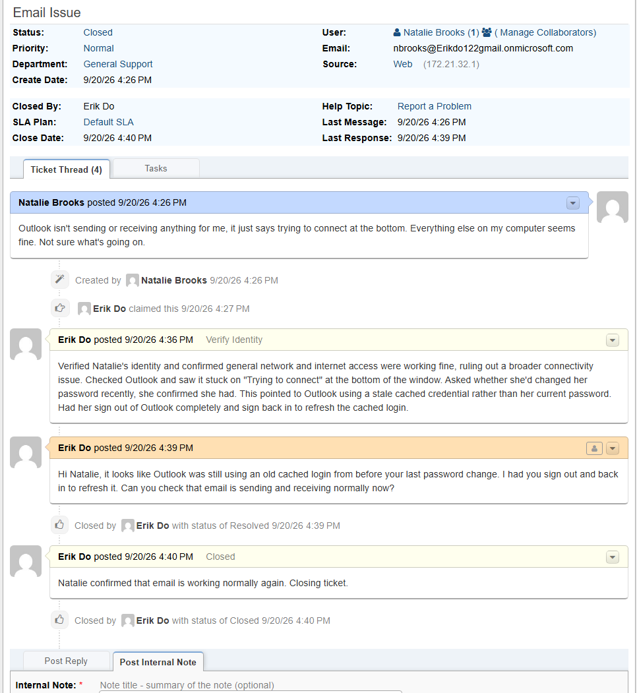

# TICKET-008: Outlook Not Sending or Receiving Email

**Requester:** Natalie Brooks (Payroll Specialist, Finance Department)
**Priority:** Normal
**Help Topic:** Report A Problem
**Department:** General Support

## Status History

| Status | Timestamp | Note |
|---|---|---|
| New | 4:26 PM | Ticket submitted via customer portal |
| Assigned | 4:26 PM | Assigned to IT agent |
| In Progress | 4:26 PM | Identity verified, triage started |
| Resolved | 4:39 PM | Outlook credential refreshed, confirmed working |
| Closed | 4:39 PM | Closed after Natalie confirmed email was working |

## Issue Description

Natalie submitted a ticket saying Outlook wasn't sending or receiving anything, showing "trying to connect" at the bottom of the window, while everything else on her computer seemed fine.

## Troubleshooting Performed

1. Verified Natalie's identity before starting.
2. Confirmed general network and internet access were working fine, ruling out a broader connectivity issue.
3. Checked Outlook and saw it stuck on "Trying to connect."
4. Asked whether she'd changed her password recently. She confirmed she had, a few days earlier.
5. This pointed to Outlook holding onto a stale cached credential rather than her current password.
6. Had her sign out of Outlook completely and sign back in to refresh the cached login.

## Root Cause

Outlook was using a cached credential from before Natalie's recent password change, causing it to fail authentication silently instead of prompting for a new password.

## Resolution

Had Natalie sign out of Outlook and back in to refresh the cached login, resolving the stale credential.

## User Impact

One user, about 13 minutes without email access. No impact to anyone else.

## Knowledge Base Reference

[KB-008: Outlook Connection Issues](../Knowledge-Base/KB-008-outlook-connection.md)
