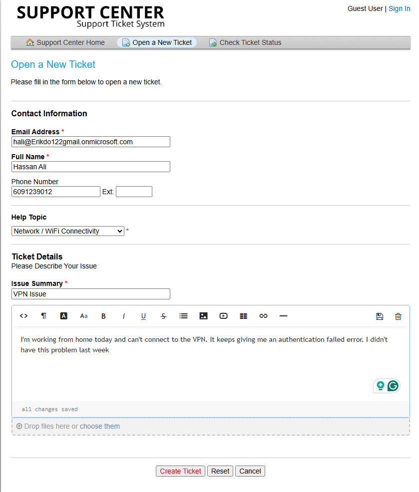
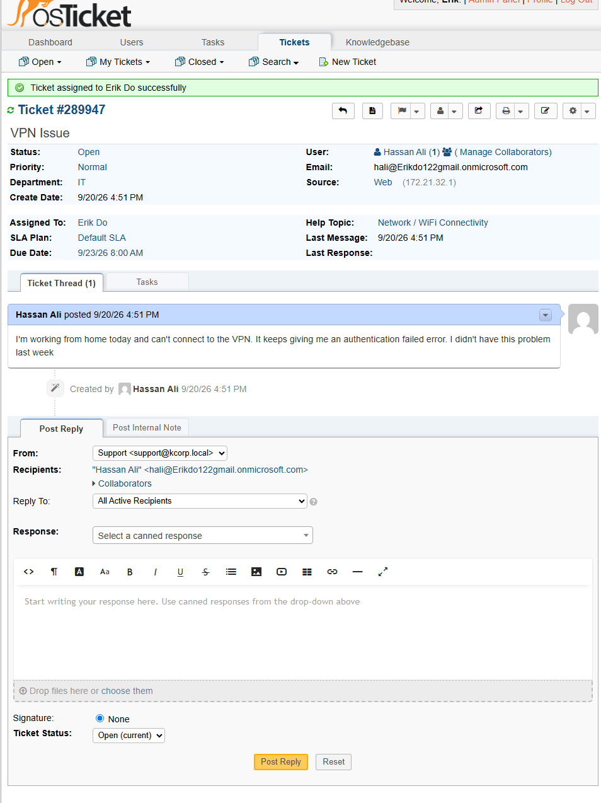
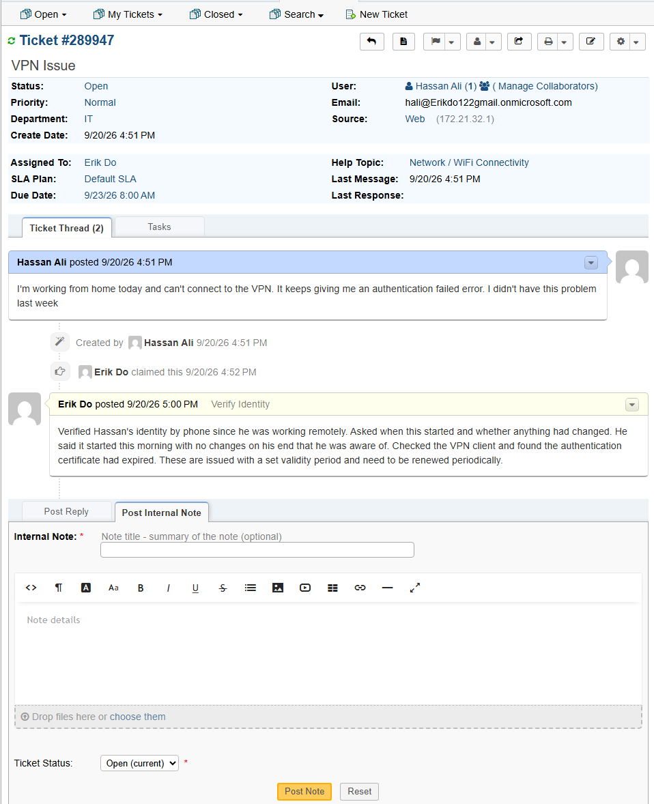
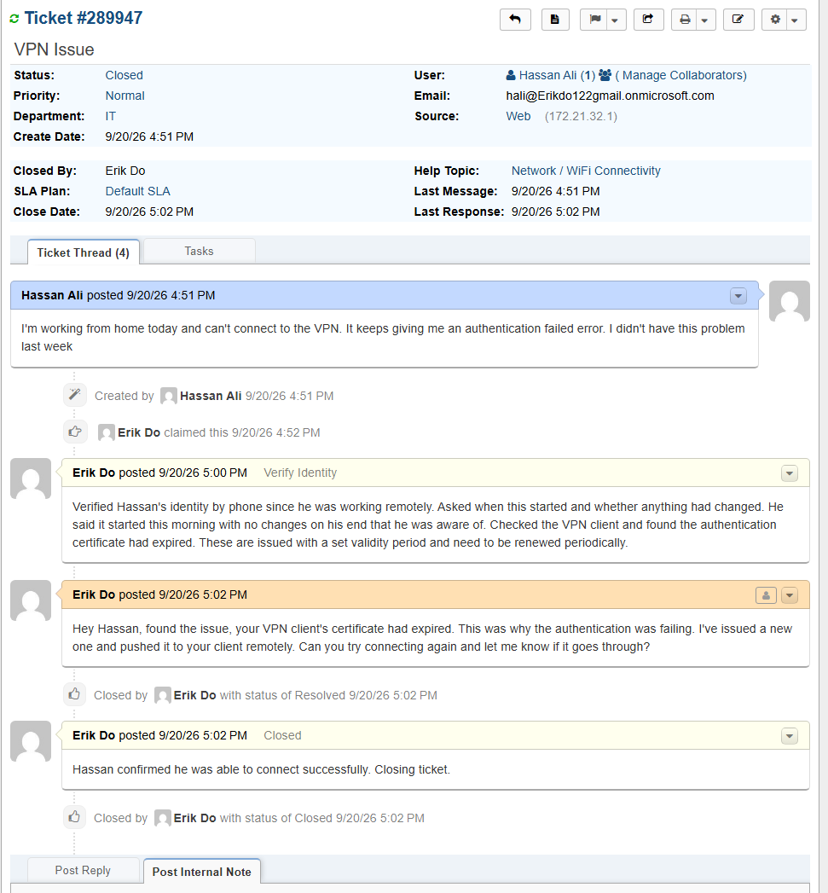

# TICKET-009: VPN Connection Failure

**Requester:** Hassan Ali (Operations Analyst, Operations Department)
**Priority:** Normal
**Help Topic:** Network/WiFi Connectivity
**Department:** IT

## Status History

| Status | Timestamp | Note |
|---|---|---|
| New | 4:51 PM | Ticket submitted via customer portal |
| Assigned | 4:51 PM | Assigned to IT agent |
| In Progress | 4:51 PM | Identity verified by phone, triage started |
| Resolved | 5:02 PM | New certificate issued, connection confirmed |
| Closed | 5:02 PM | Closed after Hassan confirmed he could connect |

## Issue Description

Hassan submitted a ticket while working from home saying he couldn't connect to the company VPN, getting an authentication failed error. He said it had been working fine the week before.

## Troubleshooting Performed

1. Verified Hassan's identity by phone, since he was working remote and not on-site.
2. Asked when the issue started and whether anything had changed on his end. He confirmed it started that morning with nothing he was aware of changing.
3. Checked the VPN client and found the authentication certificate had expired. Certificates are issued with a set validity period and need periodic renewal, something users generally aren't aware is happening in the background.

## Root Cause

Hassan's VPN client authentication certificate had expired, causing authentication to fail even though his credentials were correct.

## Resolution

Issued a new certificate and pushed it to Hassan's VPN client remotely. Confirmed with him that he was able to connect successfully before closing.

## User Impact

One user, about 11 minutes without VPN access while working remote. No impact to anyone else.

## Knowledge Base Reference

[KB-009: VPN Connection Troubleshooting](../Knowledge-Base/KB-009-vpn-troubleshooting.md)
