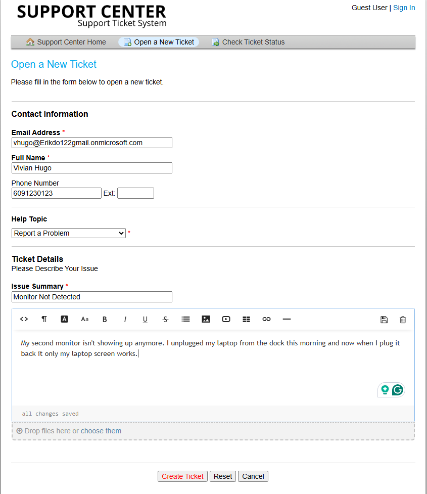
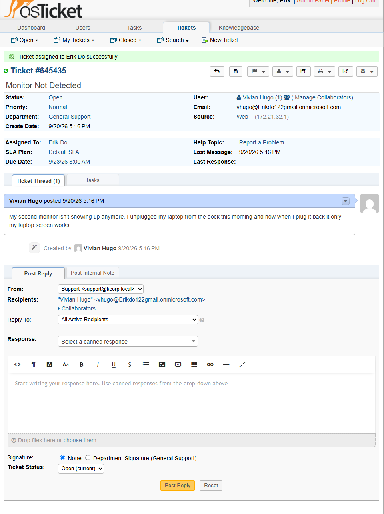
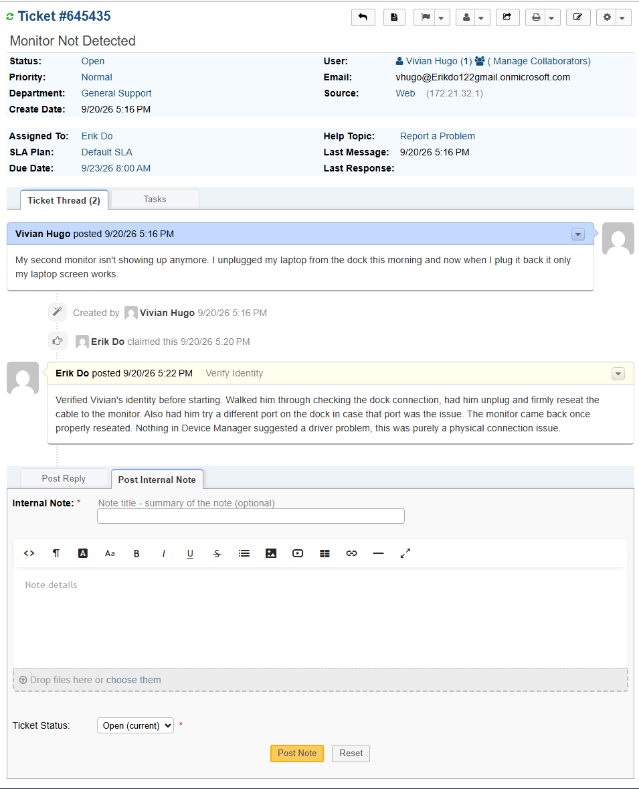
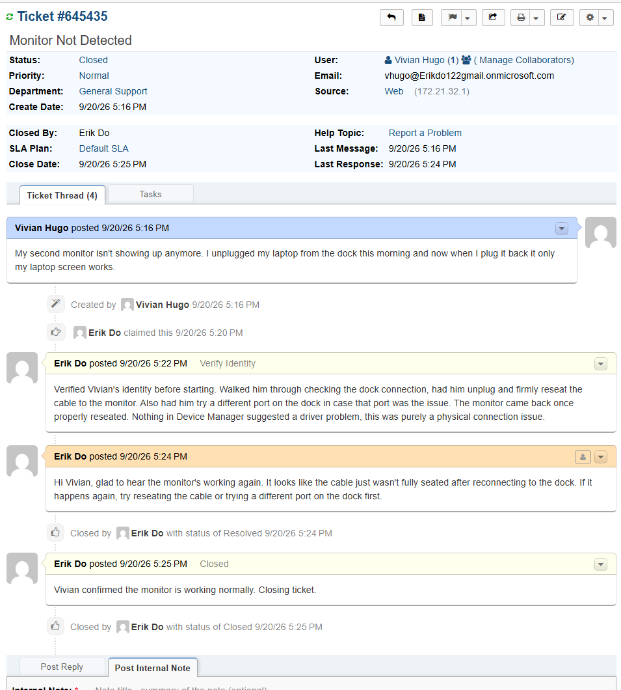

# TICKET-010: External Monitor Not Detected

**Requester:** Vivian Hugo (HR Assistant, HR Department)
**Priority:** Normal
**Help Topic:** Report A Problem
**Department:** General Support

## Status History

| Status | Timestamp | Note |
|---|---|---|
| New | 5:16 PM | Ticket submitted via customer portal |
| Assigned | 5:16 PM | Assigned to IT agent |
| In Progress | 5:16 PM | Identity verified, troubleshooting started |
| Resolved | 5:24 PM | Cable reseated, monitor confirmed working |
| Closed | 5:24 PM | Closed after Vivian confirmed the monitor was working |

## Issue Description

Vivian submitted a ticket saying his second monitor stopped showing up after he unplugged his laptop from the dock and reconnected it, only his laptop screen was working.

## Troubleshooting Performed

1. Verified Vivian's identity before starting.
2. Walked him through checking the dock connection and had him firmly reseat the cable to the monitor.
3. Had him try a different port on the dock in case that specific port was the issue.
4. The monitor came back once the cable was properly reseated.
5. Checked Device Manager, nothing suggested a driver issue, confirming this was a physical connection problem rather than a software one.

## Root Cause

The monitor cable wasn't fully seated after reconnecting to the dock, a loose physical connection rather than a driver or software issue.

## Resolution

Had Vivian reseat the cable and confirmed the monitor was detected and working again.

## User Impact

One user, about 8 minutes without a second monitor. No impact to anyone else.

## Knowledge Base Reference

[KB-010: External Monitor Not Detected](../Knowledge-Base/KB-010-monitor-not-detected.md)
